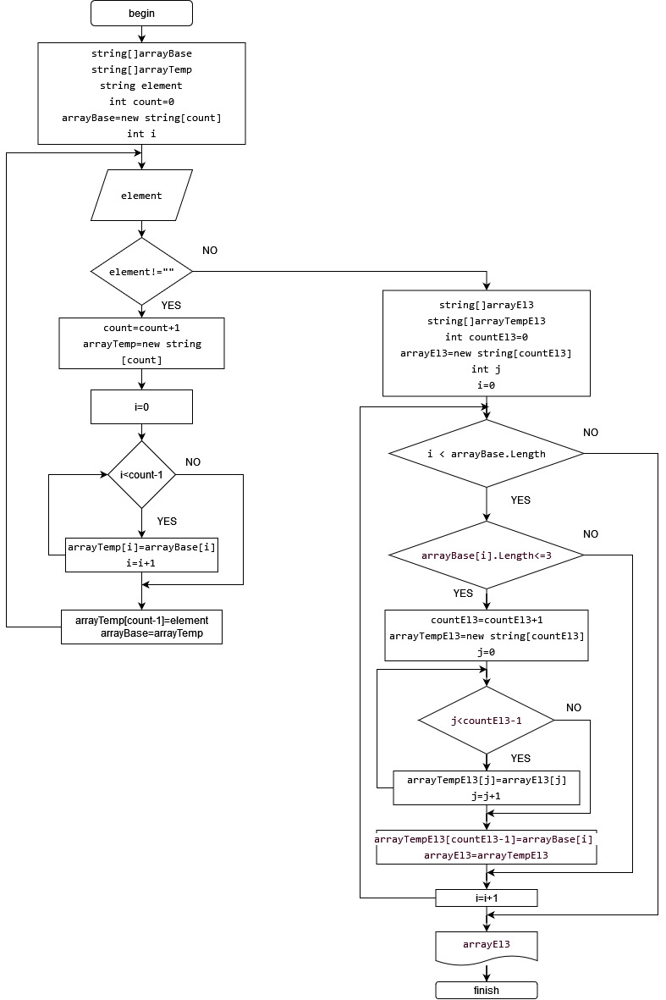

# ИТОГОВАЯ ПРОВЕРОЧНАЯ РАБОТА__version 1.0___13/03/2023.
********************************************************  

## Описание к итоговой проверочной работе.  

Данная работа направлена на проверку знаний и навыков, полученных по итогам прохождения
первого блока обучения по программе "Разработчик".

## Задача
Написать программу на C#, которая из имеющегося массива строк формирует массив из строк,  
длина которых меньше либо равна 3 символа.  
*условия к реализации*  
Первоначальный массив можно ввести с клавиатуры, либо задать на старте выполнения алгоритма.  
При решении не рекомендуется пользоваться коллекциями, лучше обойтись исключительно массивами.

#### ПРИМЕРЫ  

["hello", "2", "world", ";-)"]  ==>  ["2", ";-)"]  
["1234", "1567", "-2", "computer science"]  ==>  ["-2"]  
["Russia", "Denmark", "Kazan"]  ==>  [ ]  

## Дополнительные требования к оформлению проекта.  

1. Должен быть создан репозиторий на GitHub  
2. Должна быть предоставлена блок-схема алгоритма  
3. Необходимо снабдить репозиторий оформленным текстовым описанием решения  (README.md)
4. Необходимо написать программу, решающую задачу
5. Необходимо в работе над проектом использовать контроль версий (п.2-4 должны быть расположенны в разных коммитах)

## Выбор решения   

В текущей реализации выбран вариант ввода первоначального массива с клавиатуры. 
Строки вводятся с клавиатуры, пока не будет введена пустая строка "" (Enter).   
При решении не используются коллекции, всё выполнено исключительно с помощью массивов.  

Код состоит из двух основных блоков, не выделенных в метод:  
* создание первоначального массива с помощью ввода через клавиатуру  
* создание массива из строк, длина которых меньше либо равна 3 символам

Так как в обоих случаях конечное количество элементов массива неизвестно (сколько строк введет пользователь/сколько элементов среди них будет меньше или равно трём символам), в коде использован метод одновременного (с вводом/проверкой) формирования массива строк.  

Каждый раз при добавлении в массив нового элемента, создается дополнительный временный массив с размером на один элемент больше, с последующей перезаписью базового массива по шаблону временного.  

### _Результат отработки программы:_

> Написать программу, которая из имеющегося массива строк формирует массив из строк, длина которых меньше либо равна 3 символа.  

> Введите по очереди элементы массива строк:  
сон  
писк  
вой  
уж  
Й  
береза  
345  
98765  
5  

> Сформированный массив из строк, длина которых меньше либо равна 3 символа:  
[    'сон'      'вой'      'уж'      'Й'      '345'      '5'   ]

## Блок-схема алгоритма

******************************************  
Контактная информация:   
Мазалова Анастасия  
тел. +7 (977) 943-4531  
e-mail: pupanda@yandex.ru

